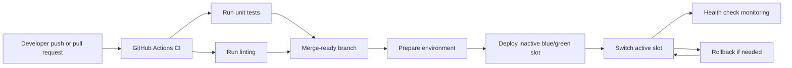
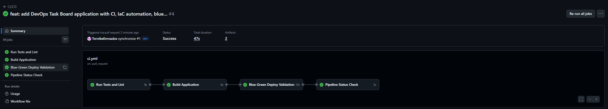
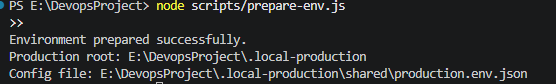
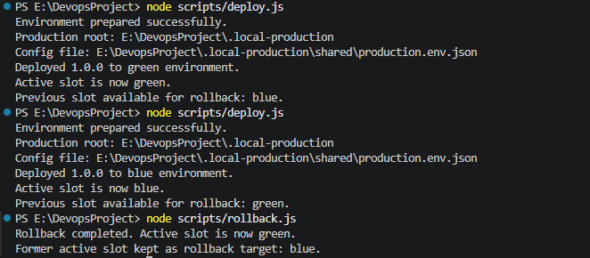
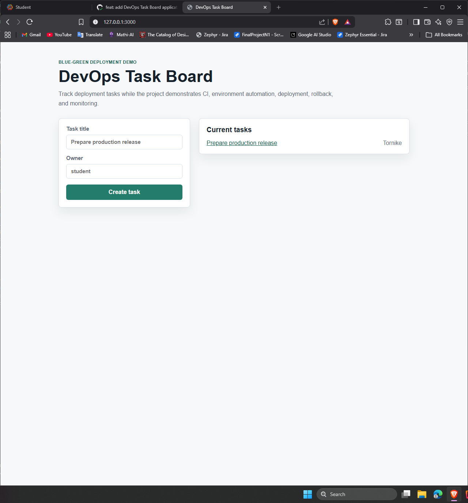
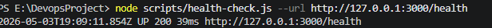

# DevOps Task Board


DevOps Task Board is a small Node.js web application built for the DevOps project requirements.
It includes a dynamic route, an input form and endpoint, automated tests, linting, GitHub Actions CI,
single-command environment preparation, a local blue-green deployment simulation, rollback, and periodic health monitoring.

Final repository link: [https://github.com/TornikeEmnadze/DevopsProject](https://github.com/TornikeEmnadze/DevopsProject)

## Tech Stack

- Node.js 20+ with the built-in `http` module
- Node.js built-in `node:test` runner for unit tests
- Custom Node.js lint script
- Git and GitHub branches: `main` and `dev`
- GitHub Actions for CI
- Node.js automation scripts for IaC, deployment, rollback, and monitoring
- Local blue-green production simulation under `.local-production`

## Application Features

- `GET /` displays the task board and an HTML input form.
- `POST /tasks` accepts form or JSON input and creates a task.
- `GET /tasks/:id` is the dynamic route for task details.
- `GET /api/tasks` returns all tasks as JSON.
- `GET /health` returns application health status for monitoring and deployment checks.

## Workflow Diagram



## Proof Screenshots

### Successful CI/CD Pipeline

The workflow runs on every push or pull request to `main` and `dev`.



### Successful IaC Execution



### Deployment Process



### Running App



### Monitoring Logs



## Step-by-Step Instructions

### 1. Clone the Repository

```bash
git clone https://github.com/TornikeEmnadze/DevopsProject.git
cd DevopsProject
```

### 2. Check Branches

The project maintains `main` and `dev` branches.

```bash
git branch -a
```

Expected branches:

```text
main
dev
origin/main
origin/dev
```

### 3. Run the Web Application

Start the app:

```bash
node src/index.js
```

Open:

```text
http://127.0.0.1:3000
```

Create a task with the form on the home page, then open the dynamic route:

```text
http://127.0.0.1:3000/tasks/1
```

### 4. Run Tests

```bash
node test/app.test.js
```

The tests verify:

- The `/health` endpoint returns an OK response.
- The `/tasks` input endpoint creates a task.
- The dynamic `/tasks/:id` route returns the created task.
- Empty task titles are rejected.

### 5. Run Linting

```bash
node scripts/lint.js
```

The lint script checks project files for trailing whitespace, missing final newlines, tab indentation, and very long lines.

### 6. Continuous Integration and Delivery

CI is configured in `.github/workflows/ci.yml`.

It runs automatically on:

- Pushes to `main`
- Pushes to `dev`
- Pull requests targeting `main`
- Pull requests targeting `dev`
- Manual runs from the GitHub Actions tab

The pipeline has four jobs:

- `Run Tests and Lint`: runs unit tests and linting.
- `Build Application`: creates a release artifact in `dist`.
- `Blue-Green Deploy Validation`: prepares local production, deploys blue, deploys green, rolls back,
  starts production, and checks `/health`.
- `Pipeline Status Check`: fails the workflow if any required job fails.

### 7. Prepare the Environment with One Command

Run the IaC automation:

```bash
node scripts/prepare-env.js
```

This creates:

- `.local-production/releases/blue`
- `.local-production/releases/green`
- `.local-production/shared/production.env.json`
- `.local-production/active-slot.json`
- `logs`

### 8. Deploy to Local Production

Run:

```bash
node scripts/deploy.js
```

The deploy script prepares the environment, copies the application into the inactive slot,
writes a release manifest, and switches the active slot.

First deploy activates `blue`. The next deploy activates `green`, while keeping `blue` available for rollback.

### 9. Run the Local Production App

After deployment, start the active production slot:

```bash
node scripts/serve-production.js
```

Open:

```text
http://127.0.0.1:3000
```

### 10. Roll Back a Deployment

Run:

```bash
node scripts/rollback.js
```

The rollback script swaps the active slot back to the previous deployment.

### 11. Run Monitoring and Health Checks

Run one check:

```bash
node scripts/health-check.js --url http://127.0.0.1:3000/health
```

Run periodic monitoring every five seconds:

```bash
node scripts/health-check.js --watch --interval 5000 --url http://127.0.0.1:3000/health
```

Health check results are appended to:

```text
logs/health-check.log
```

Example log line:

```text
2026-05-03T18:45:56.424Z UP 200 46ms http://127.0.0.1:3000/health
```

## Git Workflow

Use `dev` for active development and `main` for stable submissions.

Recommended flow:

```bash
git checkout dev
git add .
git commit -m "Implement task board application"
git push origin dev
git checkout main
git merge dev
git push origin main
```

This keeps both required branches active and lets CI run on both branches.

## Project Structure

```text
.
├── .github/workflows/ci.yml
├── docs/screenshots/
├── public/styles.css
├── scripts/
│   ├── build.js
│   ├── deploy.js
│   ├── health-check.js
│   ├── lint.js
│   ├── prepare-env.js
│   ├── rollback.js
│   ├── serve-production.js
│   └── smoke-production.js
├── src/
│   ├── index.js
│   ├── server.js
│   └── store.js
├── test/app.test.js
├── package.json
└── README.md
```

## Submission

Submit this repository link:

[https://github.com/TornikeEmnadze/DevopsProject](https://github.com/TornikeEmnadze/DevopsProject)
