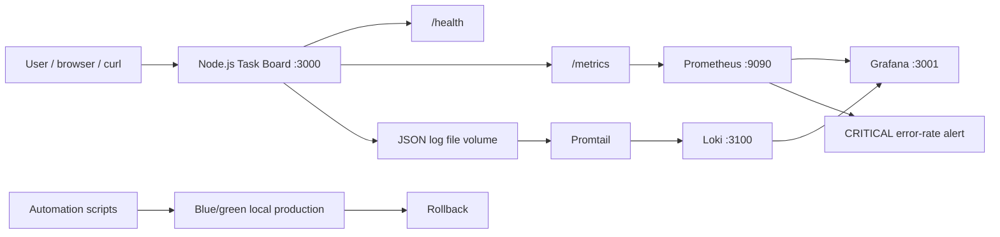
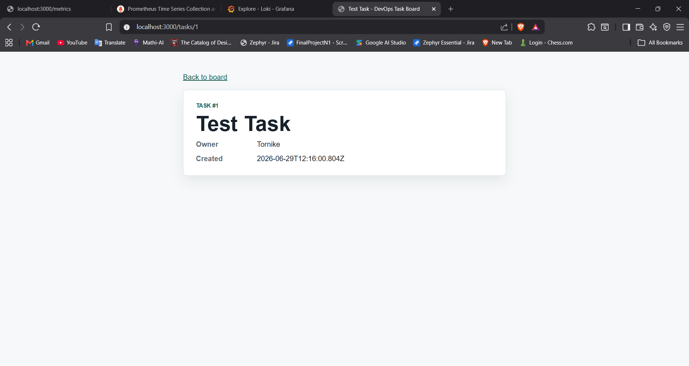
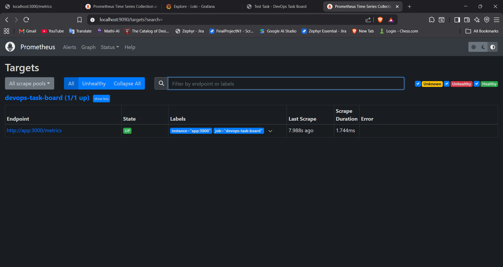
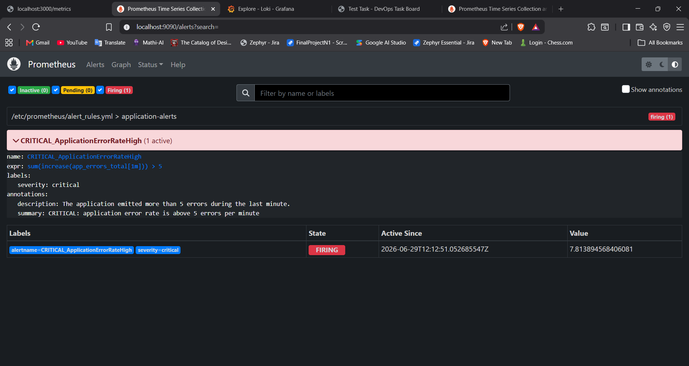
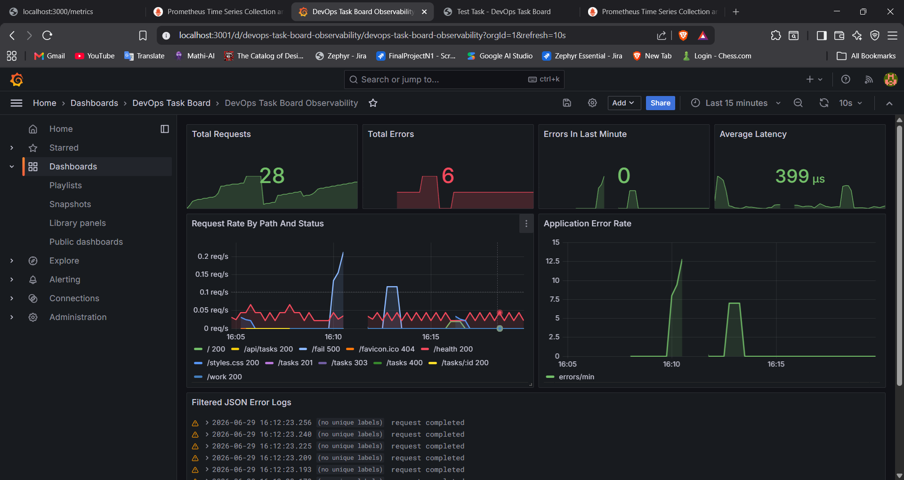
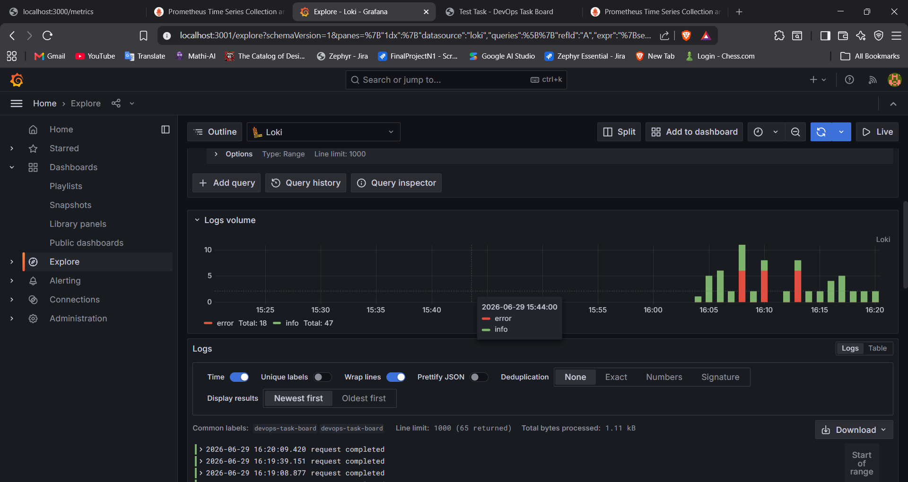
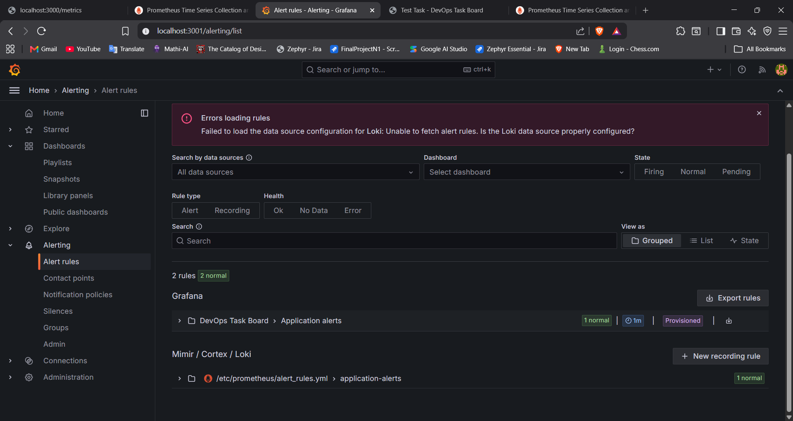

# DevOps Task Board Final Project


DevOps Task Board is the combined final version of the semester DevOps project. It keeps the original
Node.js task-board application, CI/CD workflow, local blue-green deployment simulation, rollback, and
health monitoring, then adds the observability lab stack with Docker Compose, Prometheus, Grafana,
Loki, Promtail, JSON logs, security automation, and reliability documentation.

Final repository link:

```text
https://github.com/TornikeEmnadze/DevopsProject
```

## Architecture



## Services

| Service | Purpose | URL |
| --- | --- | --- |
| app | Node.js task board with health, metrics, and JSON logs | http://localhost:3000 |
| Prometheus | Metrics collection and alert rule evaluation | http://localhost:9090 |
| Grafana | Dashboards, Loki log search, and alert view | http://localhost:3001 |
| Loki | Log storage and query backend | http://localhost:3100 |
| Promtail | Ships JSON app logs from the shared Docker volume | internal |

Default Grafana login:

```text
username: admin
password: admin
```

## One-Command Environment Setup

Run the full local environment with Docker Compose:

```bash
docker compose up --build -d
```

On Windows PowerShell, the automated setup script also validates files and prepares the local
blue-green folders:

```powershell
npm run setup
```

Open:

```text
Application: http://localhost:3000
Grafana: http://localhost:3001
Prometheus: http://localhost:9090
Loki: http://localhost:3100
```

Stop the stack:

```bash
docker compose down
```

## Application Endpoints

- `GET /` displays the task board and task form.
- `POST /tasks` creates a task.
- `GET /tasks/:id` displays a task detail page.
- `GET /api/tasks` returns all tasks as JSON.
- `GET /health` returns application health.
- `GET /metrics` exposes Prometheus metrics.
- `GET /work` simulates successful work.
- `GET /fail` simulates a server error for alert testing.

## CI/CD Workflow

GitHub Actions runs on `main`, `dev`, pull requests, and manual dispatch.

Pipeline stages:

- Unit tests with the Node.js test runner.
- Custom lint checks.
- Environment validation.
- Local security validation.
- Build artifact generation.
- Gitleaks secret scanning.
- Trivy container image scanning.
- Docker Compose smoke test with health and metrics checks.

## Local Deployment Workflow

Prepare the reproducible local production folders:

```bash
node scripts/prepare-env.js
```

Deploy to the inactive blue or green slot:

```bash
node scripts/deploy.js
```

Run the active production slot:

```bash
node scripts/serve-production.js
```

Rollback to the previous slot:

```bash
node scripts/rollback.js
```

Run post-deployment verification:

```bash
node scripts/smoke-production.js
```

## Security Implementation

Security automation is implemented locally and in CI:

- `npm audit --audit-level=moderate --omit=dev` runs when `package-lock.json` is present.
- `node scripts/security-scan.js` checks for common committed secret patterns.
- The Dockerfile uses a pinned Node base tag and runs as the non-root `node` user.
- Docker and Compose configs include healthchecks and pinned image tags.
- GitHub Actions runs Gitleaks for repository secret scanning.
- GitHub Actions runs Trivy for container image vulnerability scanning.

Run local security checks:

```bash
npm run security
```

## Monitoring, Logging, and Alerting

The app exposes these custom Prometheus metrics:

- `app_requests_total`
- `app_errors_total`
- `app_request_duration_seconds`

The app writes JSON logs to a shared Docker volume. Promtail parses fields such as `level`, `method`,
`path`, `status`, and `duration_ms`, then ships them to Loki.

Grafana LogQL examples:

```logql
{service="devops-task-board"} | json
```

```logql
{service="devops-task-board"} | json | level="error"
```

The CRITICAL alert fires when errors exceed 5 per minute:

```promql
sum(increase(app_errors_total[1m])) > 5
```

Simulate the alert:

```powershell
1..6 | ForEach-Object { curl.exe -s -o NUL -w "%{http_code}`n" http://localhost:3000/fail }
```

Then open:

```text
Prometheus alerts: http://localhost:9090/alerts
Grafana alerting: http://localhost:3001/alerting
```

## Reliability Improvements

- `GET /health` supports service health monitoring.
- Docker Compose healthchecks gate dependent services.
- `restart: unless-stopped` restarts failed services.
- Local blue-green deployment keeps a previous slot for rollback.
- `scripts/smoke-production.js` verifies deployment health.
- `docs/RELIABILITY.md` defines the availability target and recovery strategy.
- `docs/INCIDENT_RESPONSE.md` documents triage, recovery, and post-incident review.

## Screenshots


### Running Application



### Prometheus Target Health



### Prometheus Alert



### Grafana Dashboard



### Grafana Loki Logs



### Grafana Alert Rules



## Analysis

JSON structured logs are more efficient than plain text because every event has machine-readable
fields. Log tools can filter by `level`, `path`, `status`, or `trace_id` without fragile regular
expressions.

Prometheus stores numeric time-series metrics scraped from `/metrics`. Loki stores log streams and
indexes labels while keeping the full event text for investigation.

For six-month log retention, production systems should avoid keeping all logs on local Docker
volumes. Loki retention policies, compression, reduced debug volume, and object storage are better
for long-term storage.

## Project Structure

```text
.
|-- .github/workflows/ci.yml
|-- docs/
|-- grafana/
|-- loki/
|-- prometheus/
|-- promtail/
|-- public/
|-- scripts/
|-- src/
|-- test/
|-- Dockerfile
|-- docker-compose.yml
|-- package.json
`-- README.md
```
